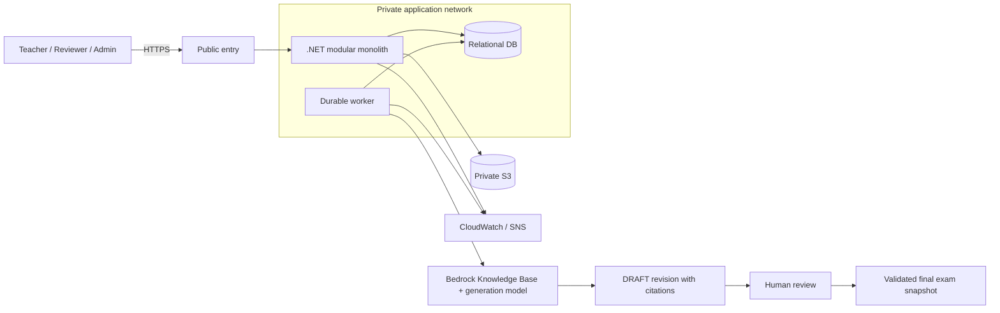

# AI Exam Bank

**Intelligent Exam Management & AI-Assisted Exam Generation Platform on AWS**

**AWS FCAJ 2026 Internship · Group: AWS Hello World**

[](https://github.com/Hungle2910/ai-exam-bank/actions/workflows/repository-quality.yml)

Ngân hàng câu hỏi tập trung và nền tảng tạo đề theo ma trận. Amazon Bedrock RAG bổ sung bản nháp cho các ô thiếu; người duyệt kiểm tra nội dung và nguồn trước khi câu hỏi được sử dụng trong đề cuối.

**Status: Foundation.** Repository có tài liệu, backlog, repository checks và một .NET API host với liveness probe. Chưa có chức năng nghiệp vụ, database, Worker/Web, IaC deployment hoặc product tests; badge trên chỉ phản ánh repository checks.

[Delivery board](https://github.com/users/Hungle2910/projects/4) · [Issues](https://github.com/Hungle2910/ai-exam-bank/issues) · [Architecture](docs/ARCHITECTURE.md) · [Getting involved](CONTRIBUTING.md) · [Readiness review](docs/REPOSITORY_REVIEW.md)

## Product scope

| Capability | MVP behavior |
|---|---|
| Question Bank | CRUD, metadata, search/filter, immutable revisions, CSV import with row-level validation |
| Identity and Review | Authentication, server-side RBAC/resource permissions, human approval/rejection and audit |
| Exam Blueprint | Subject/topic/difficulty/count/points constraints and approved-only question selection |
| AI-assisted Generation | Detect missing slots; Bedrock RAG generates validated drafts with provenance/citations |
| Final Exam | Reassemble after approval, validate matrix, persist version-pinned snapshot and preview |
| Reliability | Durable jobs, timeouts, bounded retry, idempotency, status UI and actionable monitoring |
| AWS Delivery | Private backend/DB, HTTPS entry, IAM roles, SSM, IaC, CI/CD and backup/restore evidence |

MVP targets one school/organization, single-answer MCQs and one CSV schema. **Lex V2 and SageMaker are gated extensions**; VPN requires a real hybrid use case. Student test-taking, proctoring, billing and multi-tenant SaaS are outside MVP.

**Bedrock generates. SageMaker evaluates. Lex collects intent/slots. .NET controls business rules. Human reviewers approve.**

## Target architecture



This is the **target design**, not a deployment inventory. Backend/frontend versions, DB engine, IaC tool, AWS Region, model/vector store and egress strategy are decided through [ADRs](docs/adr/README.md). AWS services must solve a concrete requirement; Kubernetes and microservices are not part of the baseline.

## Team and ownership

| Member | Official name (ASCII) | GitHub account | Responsibility | Planned effort |
|---|---|---|---|---:|
| M1 | **Le Doan Gia Hung** | [@Hungle2910](https://github.com/Hungle2910) | Architecture, contracts, blueprint, generation, final preview | 184h |
| M2 | **Nguyen Huynh Huu Phuoc** | [@HuuPhuoc-NH](https://github.com/HuuPhuoc-NH) | AWS/DevOps, import, infrastructure health | 186h |
| M3 | **Nguyen Hoang Phuc** | [@Lancelot-sys25](https://github.com/Lancelot-sys25) | Identity/RBAC, approval, audit and security | 180h |
| M4 | **Nguyen Thien Phuc** | [@flwndyy](https://github.com/flwndyy) | Question Bank, revisions, knowledge/RAG; optional Lex | 196h |
| M5 | **Tran Gia Bao** | [@TranGiaBao2005](https://github.com/TranGiaBao2005) | Jobs, reliability, monitoring; optional ML evaluation | 180h |

The group name and official member names follow the AWS FCAJ 2026 roster. Existing task IDs and some issue titles use short labels; **M3 may appear as “Minh Phúc” in older task text and refers to Nguyen Hoang Phuc / @Lancelot-sys25**. Each owner delivers **DB → API → UI → AWS/integration → tests → documentation**. All five GitHub accounts are official project collaborators; the baseline has ten assigned tasks per member, with extra maintenance tracked separately. [Detailed ownership and reviewers](docs/TEAM.md).

## Getting started

```bash
git clone https://github.com/Hungle2910/ai-exam-bank.git
cd ai-exam-bank
```

Read the architecture and your issue's dependencies/acceptance criteria before implementation. Branch from `dev`, use a short name such as `feat/M4-02-question-bank`, and submit a PR to `dev` with tests, evidence and a linked issue. After integration testing, promote `dev` to `main` through a separate reviewed PR. See [repository workflow ADR](docs/adr/0001-repository-workflow.md).

**Checks available today** — Python 3.12, Git và .NET 10 SDK (xem `global.json`); không cần Python packages:

```bash
python -m unittest discover -s tests/repository -v
python tools/check_repository.py
dotnet build AiExamBank.slnx --configuration Release
python tests/smoke/test_api_health.py
```

The checker inspects tracked files, local Markdown file links, forbidden environment/state/backup files and private-key markers. It does not validate external URLs, heading anchors, full Markdown syntax or application security. Stage new files before checking them locally.

**Run the API locally:** `dotnet run --project src/Api/AiExamBank.Api.csproj --urls http://127.0.0.1:5000`, then open `http://127.0.0.1:5000/health/live`. The endpoint reports process liveness only. M1–M5 will add module behavior, Worker/Web, database migrations, dependency lockfiles and safe config examples with the relevant implementation PRs. See [implementation plan](docs/IMPLEMENTATION_PLAN.md) and [repository workflow ADR](docs/adr/0001-repository-workflow.md).

## Delivery roadmap

| Weeks | Outcome |
|---|---|
| W01–W02 | Contracts, toolchain decisions, auth/CRUD/jobs foundations, private AWS hosting |
| W03–W04 | Approved-only generation, import/review, RAG retrieval and staging |
| W05–W06 | Live AI draft → human review → final snapshot; MVP acceptance |
| W07–W08 | Reliability/security/performance hardening; gated Lex/ML; feature freeze |
| W09–W10 | E2E acceptance, restore/recovery proof, release and handover |

**50 work packages · 10 weekly milestones · 926 planned hours.** The schedule starts Monday, 05 Oct 2026; each week's Target Date is Sunday, from 11 Oct through 13 Dec 2026. The Project is the live status source; estimates and elapsed time do not prove completion. [Backlog index](docs/BACKLOG.md) · [Tracking process](docs/PROJECT_TRACKING.md).

## Engineering and AWS standards

- Server-side authentication, role/resource authorization and input validation.
- AI output remains DRAFT/REVIEW_REQUIRED. Approved content and final snapshots are immutable; edits require a new revision and review.
- Approval/audit transaction boundaries, concurrency checks and idempotent business effects.
- Private backend/DB, least-privilege IAM, runtime roles, controlled SSM access and safe secret delivery.
- Durable recovery, measured query performance, logs/metrics with bounded retention, alert delivery proof and tested restores.
- Region-specific cost estimates, token/attempt limits, resource tagging and cleanup of idle ML/NAT/storage resources.
- PRs with independent review, required repository CI, pinned Actions, Dependabot and documented ownership. API build/liveness checks run in Application CI; product tests and deploy checks join CI with their implementations.

Design review follows the six pillars of the [AWS Well-Architected Framework](https://docs.aws.amazon.com/wellarchitected/latest/framework/welcome.html). This is an engineering baseline, not an AWS certification or claim of production readiness. [AWS strategy](docs/AWS_STRATEGY.md) · [Current controls and remaining gates](docs/REPOSITORY_REVIEW.md).

## Documentation map

| Document | Purpose |
|---|---|
| [Architecture](docs/ARCHITECTURE.md) | Modules, domain invariants, states and API boundaries |
| [AWS strategy](docs/AWS_STRATEGY.md) | Network, IAM, delivery, observability, cost and lifecycle |
| [Implementation plan](docs/IMPLEMENTATION_PLAN.md) | Detailed 10-week tasks, dependencies, outputs and DoD |
| [Team](docs/TEAM.md) | Roles, vertical slices, reviewer ownership and capacity |
| [Project tracking](docs/PROJECT_TRACKING.md) | Fields, views, workflow and completion rules |
| [Repository review](docs/REPOSITORY_REVIEW.md) | What is implemented, what is enforced and what remains |
| [Repository workflow ADR](docs/adr/0001-repository-workflow.md) | Layout, branch model and merge ownership |
| [Contributing](CONTRIBUTING.md) | Branch, PR, test, documentation and review expectations |
| [Security](SECURITY.md) | Vulnerability reporting and sensitive-data handling |

## Definition of Done

A task is Done when acceptance criteria pass, relevant tests and live-AWS evidence are attached, authorization/failure cases are covered, the PR is peer-reviewed, migrations/config are reproducible, and docs/runbooks are current. Core MVP must work with Lex/ML/VPN disabled. Mock providers are not live deployment evidence.

## Licensing and attribution

The team has not selected an open-source license. Public visibility does not grant a new license for project code or third-party corpus/model artifacts. Record source permissions before ingestion.

