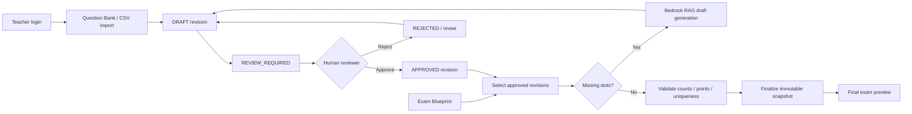
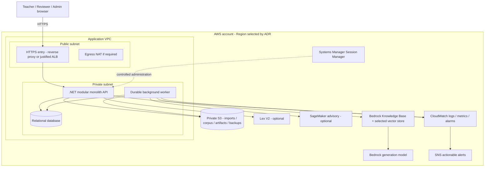

# AI Exam Bank

**Intelligent Exam Management & AI-Assisted Exam Generation Platform on AWS**

Ngân hàng câu hỏi tập trung và nền tảng tạo đề theo ma trận, kết hợp Amazon Bedrock RAG với quy trình phê duyệt của con người.

**Project status:** Planning & repository bootstrap · **Architecture:** .NET modular monolith + durable background workers · **Delivery:** 5 thành viên / 10 tuần

> Repository hiện chứa kiến trúc, quy tắc làm việc và backlog triển khai. Backend, frontend, infrastructure và các khả năng trong roadmap đang ở trạng thái **Planned** cho đến khi issue đạt Definition of Done. Tài liệu này không tuyên bố hệ thống đã production-ready, được AWS chứng nhận hoặc có tính năng chưa được kiểm chứng.

| Điều hướng | Liên kết |
|---|---|
| Delivery board | [GitHub Project](https://github.com/users/Hungle2910/projects/4) |
| Backlog | [Issues](https://github.com/Hungle2910/ai-exam-bank/issues) |
| Kế hoạch 10 tuần | [Implementation plan](docs/IMPLEMENTATION_PLAN.md) |
| Thành viên và ownership | [Team](docs/TEAM.md) |
| Kiến trúc | [Architecture](docs/ARCHITECTURE.md) |
| AWS & vận hành | [AWS strategy](docs/AWS_STRATEGY.md) |
| Tracking và DoD | [Delivery process](docs/PROJECT_TRACKING.md) |
| Đóng góp | [Contributing](CONTRIBUTING.md) |
| Báo cáo bảo mật | [Security policy](SECURITY.md) |

## 1. Product vision

AI Exam Bank giúp giáo viên quản lý phiên bản câu hỏi, xây dựng ma trận đề, chọn câu đã duyệt và bổ sung bản nháp AI cho những ô còn thiếu. Người duyệt kiểm tra nội dung, đáp án và nguồn trước khi câu hỏi được đưa vào đề cuối cùng.

Ba vấn đề chính cần giải quyết:

- Câu hỏi phân tán, metadata và trạng thái phê duyệt không nhất quán.
- Đề không đủ số câu, chủ đề, độ khó hoặc tổng điểm theo ma trận.
- Nội dung AI thiếu truy vết và có nguy cơ được sử dụng trước khi người có thẩm quyền kiểm tra.

**Nguyên tắc:** Bedrock generates · SageMaker evaluates · Lex collects intent/slots · .NET controls business rules · Human reviewers approve.

## 2. MVP scope

| Capability | Hành vi cần bàn giao | Primary owner | Status |
|---|---|---|---|
| Identity & RBAC | Login/logout, session expiry, role/resource authorization, user-role administration | Minh Phúc | Planned |
| Central Question Bank | CRUD, metadata, search/filter/pagination, immutable revision history | Thiên Phúc | Planned |
| Question import | CSV upload → validation preview → explicit commit → per-row results, idempotent retries | Hữu Phước | Planned |
| Exam Blueprint | Ma trận subject/topic/difficulty/count/points, validation và UI editor | Gia Hưng | Planned |
| Exam Generation | Approved-only selection, không trùng câu, đúng count/score, missing-slot report | Gia Hưng | Planned |
| Bedrock RAG | Tạo draft có provenance/citations từ corpus đã ingest; schema validation | Thiên Phúc | Planned |
| Human Review | Submit, approve/reject, revision concurrency, reason và audit | Minh Phúc | Planned |
| Final Exam Preview | Reassembly sau review, version-pinned immutable snapshot, answer-key permissions | Gia Hưng | Planned |
| Reliability | Durable jobs, status UI, lease/heartbeat, timeout, bounded retry và idempotency | Gia Bảo | Planned |
| AWS Delivery | Private backend/DB, HTTPS entry, IAM role, SSM, IaC, CI/CD, backup/restore | Hữu Phước | Planned |
| Observability | App/infra metrics, CloudWatch logs/alarms, SNS delivery evidence, audit trail | Gia Bảo / Hữu Phước / Minh Phúc | Planned |

MVP ban đầu giới hạn ở một tổ chức/trường, câu hỏi MCQ một đáp án đúng và một CSV schema. Hỗ trợ Lex V2 và SageMaker là **SHOULD**, chỉ mở sau khi MVP đạt gate. Site-to-Site VPN là **STRETCH**, chỉ giữ khi có use case legacy/hybrid thực tế. Hệ thống học sinh làm bài, proctoring, billing và multi-tenant SaaS nằm ngoài MVP.

## 3. End-to-end workflow



Mỗi request/job/revision có correlation và provenance để truy vết. AI drafts không được xuất hiện như approved final exam items. Sau approval, .NET chạy lại assembly và validation; approval không tự bỏ qua kiểm tra ma trận.

## 4. Target architecture



Sơ đồ là target design, không là inventory tài nguyên đã deploy. Private service access cần phương án NAT/endpoints/routing được chốt trong ADR; mũi tên SDK không có nghĩa AWS service nằm trong subnet ứng dụng.

- Modular boundaries: Identity, Question Bank, Import, Exam Blueprint, Exam Generation, Review/Audit, Knowledge/RAG, Jobs/Observability và ML advisory.
- Background workers dùng durable DB-backed job state cho MVP; thêm queue service khi có yêu cầu cụ thể.
- API và worker có thể chạy trên cùng EC2 demo hoặc processes riêng theo deploy ADR; không tách microservices/Kubernetes mặc định.
- Public access chỉ qua HTTPS entry; app và DB không public trực tiếp. Managed DB/ALB chỉ thêm khi benefits/budget rõ.
- Tên endpoint/entity chi tiết là thiết kế dự kiến; xem [Architecture](docs/ARCHITECTURE.md) và issue contracts trước triển khai.

## 5. Technology decisions

| Layer | Baseline / decision status |
|---|---|
| Backend | .NET / ASP.NET Core; phiên bản được chốt tại M1-01 |
| Data access | EF Core + relational database; DB engine và migrations được chốt bằng ADR |
| Frontend | Framework và versions quyết định tại foundation; không giả đã có app React/Next.js |
| Async processing | Durable background workers, idempotency, leases và bounded retry |
| AI generation | Amazon Bedrock + RAG / Knowledge Bases, selected embedding model/vector store |
| AI extensions | Amazon Lex V2; Amazon SageMaker difficulty advisory, gated by MVP |
| Infrastructure | AWS VPC, EC2, IAM, SSM, S3, CloudWatch, SNS; NAT/endpoints theo traffic/budget |
| IaC | Chọn **một** trong Terraform / CloudFormation / CDK và ghi ADR |
| CI/CD | GitHub Actions delivery design; build/test/deploy workflows triển khai ở M2-04/05 |

Không cài đặt version/package chỉ từ ví dụ trong tài liệu. Foundation issues phải commit lockfiles/tool versions và update hướng dẫn thực thi khi code tồn tại.

## 6. Team & module ownership

| Member | Họ tên | Role | Vertical slice | Difficulty | Planned effort |
|---|---|---|---|---|---:|
| M1 | **Gia Hưng** | Solution Architect & Exam Workflow Lead | Blueprint → generation → final preview | 5/5 | 184h |
| M2 | **Hữu Phước** | Cloud & DevOps Engineer + Import Owner | CSV upload → validation → commit → result UI; infra health | 4/5 | 186h |
| M3 | **Minh Phúc** | Security & Approval Platform Engineer | Auth → RBAC → review/approval → audit UI | 4.5/5 | 180h |
| M4 | **Thiên Phúc** | Question Bank & RAG Product Engineer | Questions → revisions → knowledge/RAG → evidence UI | 4.5/5 | 196h |
| M5 | **Gia Bảo** | Reliability & ML Evaluation Engineer | Jobs → retries → monitoring UI; optional ML advisory | 4/5 MVP; 5/5 ML | 180h |

Tổng planning estimate: **926 giờ**. Mỗi người sở hữu DB → API → UI → AWS/integration → tests → documentation. Infrastructure provisioning thuộc M2; AWS SDK/business integration thuộc owner module; IAM/security review thuộc M3. M1 quản contracts, không nhận mọi integration task.

GitHub Owner field đã dùng họ tên. Assignees và repository/project access cần usernames được xác nhận; không đoán tài khoản từ tên.

## 7. Delivery roadmap

| Week | Milestone | Exit gate |
|---|---|---|
| W01 | Foundation & contracts | Architecture/schema/auth/job/network decisions, corpus và AWS access proof |
| W02 | CRUD & AWS foundation | Local login/questions/blueprint, durable job skeleton, private EC2/SSM |
| W03 | Approved-only exam flow | Manual submit/approve → generation/gap report; import preview và idempotency |
| W04 | RAG retrieval & staging | Live retrieval có citations; staging manual flow; app safety invariants |
| W05 | Live AI draft & review | Missing slots → Bedrock draft → review/evidence/audit trên AWS |
| W06 | MVP acceptance | Final snapshot, permissions, retry/alerts, AWS E2E; no core P0 |
| W07 | Hardening & conditional ML | Restore/security/performance evidence; ML data/evaluation gate |
| W08 | Gated extensions & freeze | Lex/ML optional integration giữ invariants; feature freeze |
| W09 | Release acceptance | E2E/security/recovery/reproducibility; no core P0/P1 |
| W10 | Demo & handover | Release-tag evidence, live core demo, runbooks và access/cost handover |

Chi tiết 50 weekly work packages và các checklist con nằm trong [Project](https://github.com/users/Hungle2910/projects/4), [Issues](https://github.com/Hungle2910/ai-exam-bank/issues), [Backlog index](docs/BACKLOG.md) và [Implementation plan](docs/IMPLEMENTATION_PLAN.md). Các mốc lịch chỉ là baseline planning nếu đội chọn ngày bắt đầu; không tự đánh dấu hoàn thành từ ngày đã qua.

## 8. Repository layout

```text
ai-exam-bank/
├── README.md
├── CONTRIBUTING.md
├── SECURITY.md
├── .gitignore
├── .github/
│   ├── ISSUE_TEMPLATE/          # delivery task / bug report templates
│   └── PULL_REQUEST_TEMPLATE.md
├── docs/
│   ├── TEAM.md
│   ├── ARCHITECTURE.md
│   ├── AWS_STRATEGY.md
│   ├── PROJECT_TRACKING.md
│   ├── IMPLEMENTATION_PLAN.md
│   ├── BACKLOG.md
│   └── adr/README.md
├── src/README.md               # application implementation boundary
├── tests/README.md             # planned test strategy
└── infrastructure/README.md    # planned IaC boundary
```

Module folders, solution/projects, lockfiles và IaC resources chỉ được thêm khi foundation issues triển khai. README không đưa lệnh `dotnet run`, `npm run dev` hoặc `terraform apply` cho files chưa tồn tại.

## 9. Getting started

### Review repository and take a task

```bash
git clone https://github.com/Hungle2910/ai-exam-bank.git
cd ai-exam-bank
git switch -c feat/M1-01-foundation-contracts
```

1. Với repo private, đăng nhập GitHub và được cấp quyền trước khi clone.
2. Đọc architecture, implementation plan, team ownership và delivery process.
3. Chọn issue của mình, kiểm Dependencies/Scope/Acceptance Criteria; thống nhất contract với upstream owner.
4. Chuyển task sang **In progress** khi bắt đầu; link branch/PR và evidence vào issue.
5. Triển khai foundation trước, cập nhật commands/config example đúng các files thực tế.

### Local application setup — pending foundation

M1/M2/M3/M4/M5 phải bàn giao .NET solution, frontend scaffold, DB schema/migrations/seed, versioned toolchain, safe `.env.example` và job runner theo W01/W02. Khi có app, update setup guide với install/build/migrate/run/test commands đã thử trên clean checkout. Không commit credential hoặc config production.

## 10. Security & domain invariants

- API kiểm authentication, role và resource scope; việc ẩn nút UI không thay authorization.
- AI chỉ tạo DRAFT; submit chuyển REVIEW_REQUIRED; human reviewer mới approve/reject.
- Approved revision không bị sửa nội dung tại chỗ; edit tạo DRAFT mới, cần review lại.
- Final exam chứa approved revisions, đúng slots/count/points, không trùng question và giữ snapshot bất biến.
- Review decisions/audit có transaction boundary; expected revision/state được kiểm trước mutation.
- Idempotency ngăn trùng business effects; bounded retries và durable job leases cho crash/recovery.
- AI/retrieved text/model scores là untrusted input; schema, citations, source scope và UI escaping phải được kiểm.
- Secrets qua runtime secret/config delivery và IAM roles; không hard-code keys, không public S3/DB, không log tokens/passwords.
- Admin vận hành không tự có quyền reviewer. Self-review policy và assignment scope chốt tại M3-01.

Xem [Security policy](SECURITY.md) để báo cáo vulnerability và yêu cầu evidence an toàn.

## 11. AWS engineering standards

Design review dùng sáu trụ cột [AWS Well-Architected](https://docs.aws.amazon.com/wellarchitected/latest/framework/welcome.html): operational excellence, security, reliability, performance efficiency, cost optimization và sustainability. Đây là checklist thiết kế, không phải chứng nhận.

| Pillar | Project requirement / evidence |
|---|---|
| Operational excellence | IaC, versioned release/config, logs/metrics, deployment/rollback và runbooks |
| Security | Private app/DB, HTTPS, least-privilege IAM, SSM, secret delivery, server-side RBAC và audit |
| Reliability | Durable jobs/leases, timeout/retry/idempotency, backup/restore drill và failure states |
| Performance efficiency | Query/index measurements, representative concurrent tests, bounded AI/worker payloads |
| Cost optimization | Region-specific cost sheet, token/batch caps, retention, endpoint lifecycle và resource tags |
| Sustainability | Demo-sized resources, cleanup/retention policy, không duy trì compute/endpoint không sử dụng |

Required tags theo khả năng tài nguyên: `Project`, `Environment`, `Owner`, `ManagedBy`, `CostCenter`. Chọn naming/Region/AZ/retention/SLOs bằng ADR. Demo một AZ không được mô tả là production HA.

NAT Gateway tính phí khi tồn tại, theo giờ và dữ liệu; compare endpoints/traffic trước deploy. SageMaker real-time endpoint cần lifecycle/cleanup riêng. CloudWatch retention/cardinality và KB vector-store baseline phải nằm trong cost sheet. Xem [AWS strategy](docs/AWS_STRATEGY.md).

## 12. Testing & release gates

| Test layer | Required coverage of behavior |
|---|---|
| Unit/domain | Blueprint constraints, approved-only selection, immutable revisions, review transitions, AI output validation |
| Integration | DB transactions/concurrency, authorization/resource scope, import idempotency, worker recovery, SDK adapters |
| Frontend | Loading/error/empty/conflict states, forms, permissions reflection, source/review/job navigation |
| E2E | Login → bank/import → blueprint → generation/gaps → live RAG draft → human review → final snapshot |
| Security | Direct API 401/403/409, IDOR/role escalation, self-review policy, source/job isolation, malicious content |
| Resilience/ops | Worker kill/timeouts/throttling, bounded retry, alert delivery, clean deploy/rollback and backup restore |

Mock providers hỗ trợ development và isolated tests. **Live AWS evidence** vẫn bắt buộc để nghiệm thu deployment/Bedrock/SNS. Lex/ML/VPN tắt không được làm core MVP ngừng hoạt động.

Planned CI gates: backend/frontend build + relevant tests + secret/dependency checks + IaC validation/plan. Deployment chỉ diễn ra sau checks và environment controls phù hợp; production credentials không ở PR builds. Workflow implementation được tracking ở M2-04/05, hiện chưa claim CI green.

## 13. Definition of Done

Một issue chỉ được **Done** khi:

- Output trong scope và acceptance criteria đạt; không có placeholder business state ở flow đã nghiệm thu.
- Server validation/authorization và failure handling phù hợp; critical invariants có test.
- PR được review, checks liên quan pass, migrations/config reproducible.
- Backend/frontend/DB/AWS integration được owner thử; live proof cho yêu cầu AWS MUST.
- Docs/OpenAPI/runbook/evidence cập nhật, link PR/test/job/revision IDs vào issue.
- Không còn blocker của issue; `Actual Hours` và completion checklist phản ánh trạng thái thật.

Owner field thể hiện trách nhiệm; Assignees thể hiện GitHub accounts đã xác nhận. Priority P0 là core/critical path, P1 là mandatory hardening, P2 là gated improvements; khác với severity vulnerability.

## 14. Operations, limits and licensing

- Alerts phải có owner, threshold, recovery action và delivery evidence; không phát notification cho mọi normal state.
- Restore phải được thử, không chỉ tạo backup; release/config/database compatibility ghi trong runbook.
- Known limitations hiện tại: planning bootstrap; chưa có app deploy, CI workflow, test reports hoặc runtime SLO evidence.
- AI quality cần human review và evaluation có sample size/limitations; citation presence không chứng minh factual correctness.
- Licensing chưa được đội chốt. Không tự cấp open-source license hoặc claim quyền với tài liệu/corpus/model artifacts của bên thứ ba.

## 15. References

- [AWS Well-Architected Framework](https://docs.aws.amazon.com/wellarchitected/latest/framework/welcome.html)
- [Bedrock Knowledge Bases retrieval, generation and citations](https://docs.aws.amazon.com/bedrock/latest/userguide/kb-test-retrieve-generate.html)
- [Systems Manager private service connectivity](https://docs.aws.amazon.com/systems-manager/latest/userguide/setup-create-vpc.html)
- [Amazon VPC pricing](https://aws.amazon.com/vpc/pricing/)
- [SageMaker endpoint lifecycle](https://docs.aws.amazon.com/sagemaker/latest/dg/realtime-endpoints-delete-resources.html)
- [GitHub Projects](https://docs.github.com/en/issues/planning-and-tracking-with-projects)

Delivery board structure tham khảo [AutoWash Pro Delivery](https://github.com/users/harry-leon/projects/4); backlog/domain content được tạo riêng cho AI Exam Bank.
