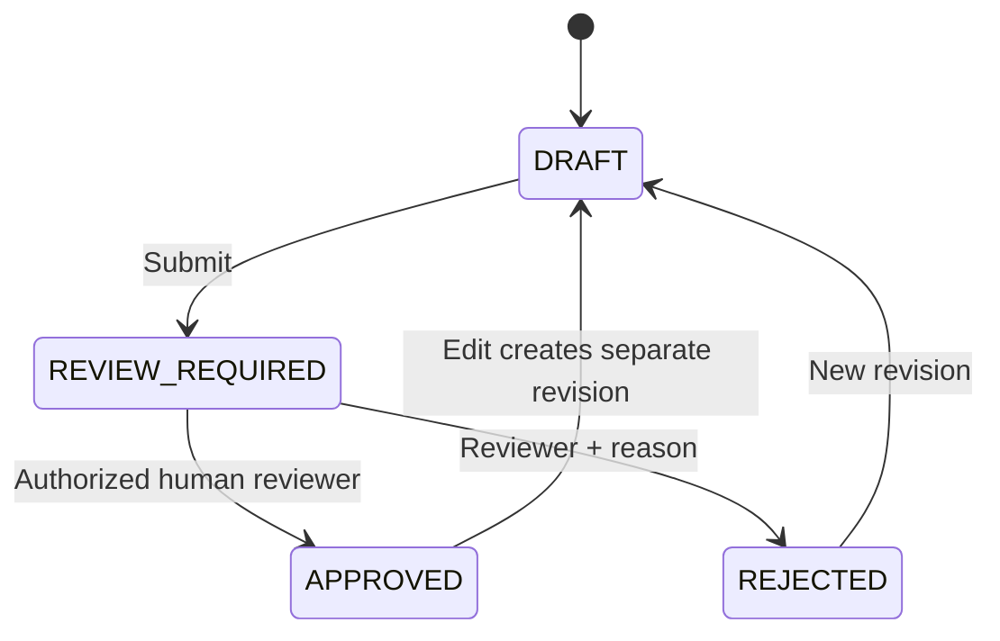

# Architecture baseline

**Status:** Proposed domain design; foundation ADRs và implementation issues quyết định cấu hình cuối. `dev` có API host và bảy module projects với hợp đồng ban đầu; chưa có workflow nghiệp vụ hoặc AWS runtime. Xem [thiết kế solution .NET](DOTNET_SOLUTION_DESIGN.md) cho cây project, hợp đồng, giao dịch và quy tắc phụ thuộc.

## Module boundaries

| Module | Responsibility | Owner |
|---|---|---|
| Identity | Users, roles, sessions, resource authorization | Minh Phúc |
| Questions | Question identities, immutable revisions, taxonomy, search | Thiên Phúc |
| Import | Upload, validation preview, idempotent commit, row results | Hữu Phước |
| Exams | Blueprint constraints, approved-only selection, gap report, snapshot | Gia Hưng |
| Review/Audit | Decisions, transitions, reason, concurrency, durable audit | Minh Phúc |
| Knowledge/RAG | Corpus lifecycle, retrieval filters, draft generation, citations | Thiên Phúc |
| Jobs/Observability | Durable state/attempts/leases, retry, failure status, telemetry | Gia Bảo |
| ML advisory | Dataset/model evaluation và optional inference | Gia Bảo |

Dependency rules: controllers gọi application use cases; domain không phụ thuộc AWS/provider DTOs; provider adapters nằm ở infrastructure boundary; frontend dùng versioned API contracts. Không duplicate approval engine hoặc question writer trong import/AI modules.

## Domain data and invariants

- Question giữ identity. QuestionRevision lưu nội dung, options/answer, metadata, provenance và status của phiên bản; approved content bất biến.
- ReviewDecision gắn chính xác revision và reviewer; server recheck quyền/scope/state/version trước commit. Approval và business audit có atomic boundary.
- BlueprintSlot định nghĩa subject/topic/difficulty/count/points. Selection không trùng question identity và chỉ dùng approved revisions.
- Exam snapshot pin revision/content; edits sau finalize không thay đề. Count/score/uniqueness được revalidate trước finalization.
- Job/Attempt giữ durable workflow state, idempotency key và lease/heartbeat. Crash/retry không nhân đôi database effects.
- KnowledgeSource/Citation lưu source version/hash/location và access scope. Source references từ model không được coi là quyền đọc.
- DifficultyAssessment là advisory; không tự overwrite label approved hoặc approval state.

## States

Mũi tên APPROVED → DRAFT nghĩa tạo **revision mới**, không mutate approved content. AI chỉ tạo DRAFT. Exam states phải phân biệt GENERATING/NEEDS_REVIEW/PARTIAL/FAILED/FINALIZED; không trả COMPLETE khi còn missing/unapproved items.

## API contract expectations

Endpoint names là proposed, không implemented:

- `/auth/*`, `/admin/users/*`: identity/session/role administration.
- `/questions/*`: CRUD, filters, revisions; update approved tạo draft mới.
- `/imports/*`: upload/validate preview/explicit commit/result.
- `/blueprints/*`: matrix CRUD và constraints.
- `/exams/generate`, `/exams/{id}/finalize`, `/exams/{id}/preview`: exam workflow.
- `/reviews/pending`, `/reviews/{id}/decision`, `/audit`: approval và audit.
- `/jobs/*`, `/admin/infrastructure/health`: status, recovery và protected health.
- Knowledge/difficulty/Lex adapters reused by authenticated .NET use cases; không tạo anonymous bypass.

API host hiện trả RFC Problem Details cho JSON clients khi có lỗi HTTP chưa được xử lý hoặc route không tồn tại, kèm `traceId` để đối chiếu log. Contract nghiệp vụ cần thêm `code` ổn định, thông điệp an toàn, validation details và correlation ID; semantics: 401 missing/expired identity; 403 denied permission/scope; 409 state/revision conflict. OpenAPI cần examples và negative cases khi có endpoint nghiệp vụ.

## Decisions to record

Backend/frontend/toolchain versions, DB engine, identity flow, revision/concurrency strategy, worker lease algorithm, IaC tool, Region/model/vector store, network/egress/entry/DB hosting và cost limits. Xem [ADR process](adr/README.md). Decisions phải giữ coherent monolith boundaries; không tăng service count vì hình thức.
