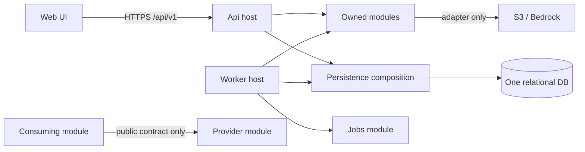

# Thiết kế solution .NET cho AI Exam Bank

**Trạng thái:** Thiết kế mục tiêu để M1–M5 review. **Owner:** M1 / Le Doan Gia Hung. **Ngày:** 09/10/2026. Solution hiện có API, bảy module projects chứa hợp đồng/giá trị đầu tiên và ba test projects; database, Worker, Web và các use case nghiệp vụ chưa được triển khai. [ADR 0002](adr/0002-dotnet-module-boundaries.md) ghi quyết định và đánh đổi.

## Mục tiêu và ràng buộc

- MVP cho một trường/tổ chức: ngân hàng câu hỏi, duyệt, ma trận đề, AI draft qua Bedrock, đề cuối bất biến, import và job bền vững.
- Năm thành viên phát triển song song trong 10 tuần; một database quan hệ và một đường phát hành AWS cần kiểm thử được. Không có nhu cầu scale độc lập từng module đã được chứng minh.
- Một **modular monolith**: `Api` phục vụ HTTP, `Worker` xử lý job sau khi hợp đồng M5 được duyệt. Hai host dùng cùng domain/contracts và database, nhưng có vòng đời/triển khai riêng. Frontend gọi API, không gọi trực tiếp AWS hoặc database.
- Ưu tiên ít project và ít lớp trừu tượng. Scaffold module có hợp đồng/giá trị thực và owner; mỗi use case tiếp theo phải có hành vi chạy được cùng test, không thêm class rỗng chỉ để đủ sơ đồ.

## Cây solution mục tiêu

Ký hiệu `✓` là đã có trong scaffold hiện tại; `+` là tạo khi lát cắt đầu tiên cần nó. Module project hiện có không đồng nghĩa module nghiệp vụ đã hoàn thành.

```text
AiExamBank.slnx                         ✓ solution duy nhất
global.json / Directory.Build.props    ✓ SDK, TFM, nullable, build rules
src/
  Api/                                  ✓ HTTP composition root, health, errors
    AiExamBank.Api.csproj
  Modules/
    Identity/                            ✓ actor contract; + auth/policy
    Review/                              ✓ decision request; + audit/transition
    Questions/                           ✓ revision reference; + CRUD/taxonomy
    Knowledge/                           ✓ citation; + source/RAG adapter
    Exams/                               ✓ blueprint slot; + selection/snapshot
    Import/                              ✓ batch reference; + validate/commit
    Jobs/                                ✓ job reference; + durable lifecycle
  Persistence/                           + một EF Core DbContext và migration stream
  Worker/                                + host khi M5 có handler thật
  Web/                                   + frontend sau ADR chọn framework
tests/
  smoke/                                 ✓ HTTP baseline
  repository/                            ✓ repo/ownership checks
  Modules/{Questions,Exams}.Tests/       ✓ first domain validation tests
  Architecture.Tests/                   ✓ module dependency test
  Modules/Jobs.Tests/                    ✓ scoped job contract validation
  Modules/<OtherModule>.Tests/           + use-case tests theo owner
  Integration/                           + DB, auth, transaction, API tests
  EndToEnd/                              + hành trình người dùng sau khi có UI
```

Mỗi module hiện là **một project .NET** với hợp đồng/giá trị nhỏ để solution và ownership ổn định; đây chưa phải hành vi nghiệp vụ hoàn chỉnh. Bên trong project, bắt đầu bằng các thư mục `Domain/`, `Application/`, `Contracts/`, `Infrastructure/` và `Endpoints/` **chỉ khi thư mục có code thực**. `Contracts/` là API công khai của module cho module khác; `Infrastructure/` chỉ chứa adapter ngoài database của module (nếu có). EF mappings/repositories nằm trong `Persistence/<Module>/` và triển khai interface do module sở hữu. Nếu phụ thuộc provider SDK làm domain khó kiểm soát, tách adapter thành project riêng tại thời điểm đó. Không cần mặc định 3–4 project cho mỗi module.

`Persistence` được tạo cùng lựa chọn DB/EF đã review. Project này tham chiếu module contracts/domain; module **không tham chiếu ngược** `Persistence`. Một DbContext và một migration stream giúp approval + audit + đổi trạng thái revision nằm trong một transaction. Mỗi owner đặt entity configuration/query của mình trong `Persistence/<Module>/`; M1 điều phối migration liên module và reviewer của bảng liên quan phải duyệt. Không để hai PR cùng tự tạo migration trên cùng schema rồi merge không kiểm tra thứ tự. Đây là **đề xuất**, chưa phải quyết định DB engine/hosting cuối cùng.

## Hướng phụ thuộc và điểm tích hợp



| Quy tắc | Áp dụng |
|---|---|
| Host | `Program.cs` chỉ đăng ký DI, middleware và endpoint groups. Không đặt chọn câu, duyệt hoặc retry ở host. |
| Domain | Entity/value object/state rules không phụ thuộc ASP.NET, EF Core, AWS SDK hoặc transport DTO. |
| Application | Use case xác thực đầu vào, quyền actor/scope, trạng thái, transaction và cancellation; trả kết quả có nghĩa nghiệp vụ. |
| Infrastructure | EF adapters nằm trong `Persistence`; S3/Bedrock/clock/provider adapters nằm sau hợp đồng application. Không để SDK DTO lộ sang domain/API contract. |
| Persistence references | `Persistence` tham chiếu các module để map entity/triển khai repository; module không tham chiếu `Persistence`, còn `Api`/`Worker` đăng ký cả hai qua DI. |
| Cross-module | Consumer dùng contract công khai do **provider** sở hữu; không đọc bảng hoặc gọi DbContext riêng của module khác. Nếu dependency cycle xuất hiện, M1 và hai owner rút ra contract nhỏ tại boundary thay vì cho hai project reference vòng. |
| API | Mỗi module tự khai báo DI + route group `/api/v1/<resource>`; host gọi đăng ký rõ ràng, không reflection scan. M3 áp chính sách auth/resource scope; mọi endpoint nghiệp vụ phải có chính sách hoặc lý do public được review. |
| Worker | M5 sở hữu dispatch, lease, retry và job state. Owner của import/generation sở hữu handler nghiệp vụ. Handler dùng DI scope riêng, cancellation và idempotency key; không chạy job dài trong request HTTP. |

Hợp đồng tối thiểu cần chốt trước code liên module: `QuestionRevisionRef` (ID + version + status), `ApprovedQuestionRead` (chỉ approved, có scope), `ReviewDecision` (actor, reason, expected version), `BlueprintSlot` (taxonomy/count/points), `JobRequest/Status` (actor/scope/idempotency/correlation). M4 sở hữu revision/taxonomy; M3 sở hữu decision/audit; M1 sở hữu blueprint/snapshot; M5 sở hữu job lifecycle. Tên và kiểu cuối cùng nằm trong PR contract có ví dụ và test, không coi bảng này là API đã phát hành.

**Transaction khó nhất:** khi M3 duyệt một revision, M4 phải đổi trạng thái đúng revision/version và M3 ghi decision + audit trong **một DB transaction**. Không phát event/HTTP rồi coi hai ghi là atomic. Khi đề được finalize, M1 kiểm lại quyền, số lượng, điểm, uniqueness và chỉ lấy approved revision; snapshot lưu version/nội dung đã pin. Worker retry không được tự duyệt câu hỏi hoặc tạo snapshot trùng. Các invariant chi tiết ở [Architecture](ARCHITECTURE.md).

## API, cấu hình và vận hành

- Bắt đầu bằng endpoint groups theo module. Hợp đồng lỗi dùng RFC Problem Details với `traceId`; khi có nghiệp vụ thêm `code` ổn định, validation details và mapping 400/401/403/404/409/500. Không trả stack trace, secret hay nội dung đề cho client.
- `/health/live` hiện chỉ kiểm tiến trình. M2/M5 thêm `/health/ready` khi có DB/worker/dependency thật; giới hạn thời gian kiểm, không gọi Bedrock tính phí để kiểm health. Health nhạy cảm của hạ tầng nằm sau auth.
- Cấu hình dùng environment variables/SSM và options validation at startup cho giá trị bắt buộc. Chỉ commit ví dụ không có secret. IAM role của runtime thay access key tĩnh; dev/staging/prod tách config và deployment evidence.
- Log có cấu trúc với trace ID, job ID và release version; không log token, toàn bộ prompt, đáp án hoặc dữ liệu cá nhân mặc định. M5 định nghĩa metric/job failure; M2 cấu hình retention, alarms và delivery proof trên AWS.
- Khi có NuGet package đầu tiên, dùng version pinning nhất quán; nếu nhiều project dùng chung thì thêm `Directory.Packages.props`. Commit `packages.lock.json` cho project deployable và chạy restore locked mode trong CI. Không tạo manifest/dependency rỗng trước khi cần.

## Kiểm thử và CI theo mức rủi ro

| Cấp | Owner | Điều cần chứng minh |
|---|---|---|
| Build/smoke hiện có | M1 | Solution Release build; API liveness và 404 Problem Details qua HTTP. |
| Domain/use case | Chủ module | Invalid MCQ/matrix, revision bất biến, permission denial, transition sai, idempotency; test kết quả quan sát được. |
| Integration DB/API | M1 + chủ module + M3 | Migration từ DB sạch, CRUD roundtrip, 401/403/409, approval/audit atomic, concurrent review/finalize, query scope. |
| Worker/recovery | M5 + handler owner | Restart, two workers, lease expiry, timeout sau DB write, duplicate key, bounded retry và failed status. |
| End-to-end/staging | Cả nhóm, M2 vận hành | Teacher tạo/nhập câu → review → blueprint → AI draft → approve → final snapshot; AWS IAM/network/restore/rollback có bằng chứng trên commit phát hành. |

CI mở rộng theo project thật: restore locked → build warnings-as-errors → tests → smoke/API → migration validation → artifact/deploy checks. `Application CI` phải thành required check trên `dev` sau khi nền đã merge và chạy xanh; promotion `dev → main` kiểm lại **đúng commit** chuẩn bị phát hành. CodeRabbit hỗ trợ phát hiện lỗi, còn approval độc lập vẫn cần theo branch protection.

## Thứ tự triển khai cho nhóm

1. **M1 + M2/M3 review:** merge nền API vào `dev`; chốt ADR 0002, DB/identity/API contract cùng M4/M5. Không tự nhận tài liệu đề xuất là quyết định đã duyệt.
2. **M4 + M3:** Questions/Review và transaction approval; tạo project/module + migration/test cùng hành vi đầu tiên. M1 chỉ chuẩn hóa contract tích hợp.
3. **M1 + M2:** Exams/Import dùng public contracts của M4; test approved-only selection, import idempotency và snapshot bất biến.
4. **M5:** Jobs project + Worker host khi có durable handler; M1/M2/M4 thêm handler của mình, M5 kiểm restart/retry/telemetry.
5. **M2 + tất cả owner:** frontend, AWS deployment, migration/backup/restore, readiness và E2E staging. Chỉ gắn nhãn “hoàn thiện” khi các gate trong [foundation status](DOTNET_FOUNDATION.md) có bằng chứng.

## Điều kiện review thiết kế

Mỗi owner xác nhận: module của mình sở hữu dữ liệu nào; contract nào được module khác gọi; ai ghi trạng thái; transaction nào cần atomic; endpoint nào cần role/scope; failure nào phải retry hoặc dừng; test nào chứng minh hành vi. Nếu một module không trả lời được những câu đó, chưa thêm project/DbContext chỉ để lấp chỗ trống trong solution.

## Nguồn kỹ thuật

- [ASP.NET Core route groups](https://learn.microsoft.com/en-us/aspnet/core/tutorials/min-web-api?view=aspnetcore-10.0) cho endpoint theo module.
- [ASP.NET Core options validation](https://learn.microsoft.com/en-us/aspnet/core/fundamentals/configuration/options?view=aspnetcore-10.0) cho cấu hình bắt buộc khi khởi động.
- [.NET BackgroundService và scoped services](https://learn.microsoft.com/en-us/dotnet/core/extensions/scoped-service) cho Worker.
- [NuGet lock files](https://learn.microsoft.com/en-us/nuget/consume-packages/package-references-in-project-files) cho restore tái lập.
