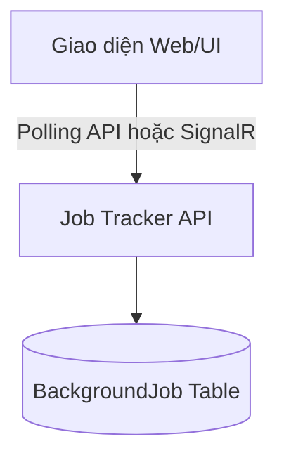

# M5-01: Reliability UI Wireframe

## 1. Màn hình Quản lý Background Jobs (Job Tracker)

Đây là wireframe đề xuất, chưa có UI/API chạy thật. Người dùng chỉ xem job của mình trong phạm vi trường hoặc kỳ thi cấp Bộ được giao; vai trò quản trị không mặc định đọc nội dung job khác phạm vi.



### 1.1. Wireframe Phác thảo (Text-based)

```text
=============================================================================================
|  AI EXAM BANK - BẢNG ĐIỀU KHIỂN                                         [User Profile]    |
=============================================================================================
|  +-------------------+  [ Tác vụ ngầm (Background Jobs) ]                                 |
|  | Dashboard         |                                                                    |
|  | Ngân hàng câu hỏi |  Lọc theo: [ Tất cả ] [ Đang chạy ] [ Lỗi ]      [ Làm mới (F5) ]  |
|  | Đề thi            |                                                                    |
|  | > Tác vụ ngầm     |  ----------------------------------------------------------------- |
|  +-------------------+  | ID Tác vụ | Loại Tác Vụ      | Trạng Thái  | Tiến Độ | Hành Động|
|                         | --------- | ---------------- | ----------- | ------- | -------- |
|                         | #AB123... | Sinh Đề Thi AI   | [Running]   | 45%     | [Huỷ]    |
|                         | #CD456... | Import CSV       | [Failed]    | —       | [Sửa file]|
|                         | #EF789... | Import CSV       | [Completed] | 100%    | [Xem KQ] |
|                         | #AA012... | Sinh đề AI       | [Pending]   | —       | [Huỷ]    |
|                         ----------------------------------------------------------------- |
|                                                                                           |
|  [ Panel Chi tiết lỗi (Nếu bấm vào dòng Failed) ]                                         |
|  Lỗi Tác vụ #CD456:                                                                       |
|  - Error: Dữ liệu dòng 15 bị thiếu trường 'Đáp án đúng'.                                  |
|  - Hướng xử lý: Sửa file CSV và tạo yêu cầu import mới.                                   |
=============================================================================================
```

## 2. Ý tưởng tương tác (UX Notes)
1. **Tiến độ (Progress):** Chỉ hiển thị % khi handler đo được; nếu không, hiển thị trạng thái không có % giả. Polling/API interval và SignalR là lựa chọn còn phải kiểm chứng theo tải/chi phí.
2. **Thử lại (Retry):** Chỉ hiển thị cho lỗi tạm thời và người còn quyền. Không cho reset vô hạn attempt; lỗi validation yêu cầu sửa dữ liệu và tạo yêu cầu mới. Backend kiểm lại phạm vi ở mỗi thao tác.
3. **Nút Xem KQ (View Result):** Dành cho các Job thành công, ví dụ bấm vào sẽ chuyển hướng sang màn hình Chi tiết Đề thi vừa sinh ra.
