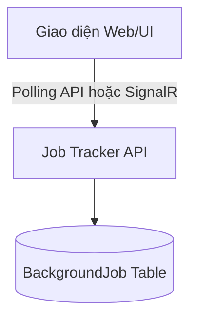

# M5-01: Reliability UI Wireframe

## 1. Màn hình Quản lý Background Jobs (Job Tracker)

Giao diện này cho phép Quản trị viên (Admin) hoặc người dùng xem trạng thái các tác vụ chạy ngầm của họ.



### 1.1. Wireframe Phác thảo (Text-based)

```text
=============================================================================================
|  AI EXAM BANK - BẢNG ĐIỀU KHIỂN                                         [User Profile]    |
=============================================================================================
|  +-------------------+  [ Tác vụ ngầm (Background Jobs) ]                                 |
|  | Dashboard         |                                                                    |
|  | Ngân hàng câu hỏi |  Lọc theo: [ Tất cả ] [ Đang chạy ] [ Lỗi ]      [ Làm mới (F5) ]  |
|  | Đề thi            |                                                                    |
|  | > Tác vụ ngầm     |  ----------------------------------------------------------------- |
|  +-------------------+  | ID Tác vụ | Loại Tác Vụ      | Trạng Thái  | Tiến Độ | Hành Động|
|                         | --------- | ---------------- | ----------- | ------- | -------- |
|                         | #AB123... | Sinh Đề Thi AI   | [Running]   | 45%     | [Huỷ]    |
|                         | #CD456... | Import Excel     | [Failed]    | 100%    | [Thử lại]|
|                         | #EF789... | Import Excel     | [Completed] | 100%    | [Xem KQ] |
|                         | #AA012... | Chấm điểm        | [Pending]   | 0%      | [Huỷ]    |
|                         ----------------------------------------------------------------- |
|                                                                                           |
|  [ Panel Chi tiết lỗi (Nếu bấm vào dòng Failed) ]                                         |
|  Lỗi Tác vụ #CD456:                                                                       |
|  - Error: Dữ liệu dòng 15 bị thiếu trường 'Đáp án đúng'.                                  |
|  - Hướng xử lý: Vui lòng sửa lại file Excel và import lại hoặc bấm [Thử lại].             |
=============================================================================================
```

## 2. Ý tưởng tương tác (UX Notes)
1. **Tiến độ (Progress):** Cột Tiến Độ sẽ tự động được cập nhật (auto-refresh) thông qua cơ chế Polling API 5 giây/lần hoặc dùng WebSockets (SignalR).
2. **Nút Thử lại (Retry):** Chỉ xuất hiện đối với các Jobs bị lỗi (Failed). Khi bấm vào, UI sẽ gọi lại API để tạo ra một Attempt mới cho Job này (nếu lỗi đó là có thể thử lại - retriable).
3. **Nút Xem KQ (View Result):** Dành cho các Job thành công, ví dụ bấm vào sẽ chuyển hướng sang màn hình Chi tiết Đề thi vừa sinh ra.
